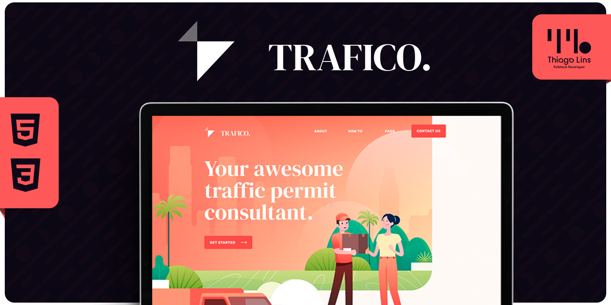
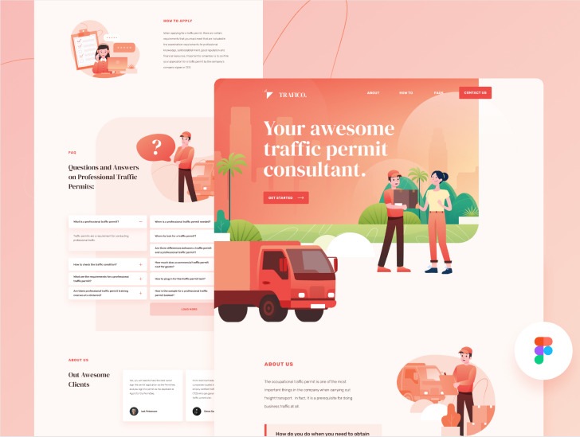

<div align="center" id="top">
  

&#xa0;

</div>

<h1 align="center">Challenge Project Fullstack</h1>

<p align="center">
  

  

  

  

  <!--  -->

  <!--  -->

  <!--  -->
</p>

<!-- Status -->

<!-- <h4 align="center">
	🚧  Challenge Project Fullstack 🚀 Em construção...  🚧
</h4>

<hr> -->
<p align="center">
 <br/>
  <a href="https://www.figma.com/file/LXL0ateBdMj1PLjkGRzQPF/traffico-landing-page-for-figma?node-id=0:1">Layout</a> &#xa0; |<a href="#dart-sobre">Sobre</a> &#xa0; | &#xa0;
  <a href="#rocket-tecnologias">Tecnologias</a> &#xa0; | &#xa0;
  <a href="#white_check_mark-pré-requesitos">Pré requisitos</a> &#xa0; | &#xa0;
  <a href="#checkered_flag-começando">Começando</a> &#xa0; | &#xa0;
  <a href="#memo-licença">Licença</a> &#xa0; | &#xa0;
  <a href="https://github.com/thiilins" target="_blank">Autor</a>
</p>

<br>

## :dart: Sobre

Este desafio tem como objetivo treinar sua habilidades em construir uma aplicação fullstack e reflete a realidade de desafios tecnicos para a posição de desenvolvedor fullstack.
Repositório com instruções do desafio : [DigitalHouseBrasil/Challenge-Project-Fullstack](https://github.com/DigitalHouseBrasil/Challenge-Project-Fullstack)

## :rocket: Tecnologias

As seguintes ferramentas foram usadas na construção do projeto:

- Node.JS
- EJS (HTML | CSS | JS )
- Sequelize
- Mysql
- MVC

## :white_check_mark: Pré requisitos

Antes de começar :checkered_flag:, você precisa ter o [Git](https://git-scm.com) e o [Node](https://nodejs.org/en/) instalados em sua maquina.

## :checkered_flag: Começando

```bash
# Clone este repositório
$ git clone https://github.com/thiilins/challenge-project-fullstack
# Antes de iniciar importe o banco de dados 'trafego_log.sql' que  está na pasta /src/database
# Entre na pasta
$ cd challenge-project-fullstack

# Instale as dependências
$ yarn

# Para iniciar o projeto
$ yarn start

# O app vai inicializar em <http://localhost:3000>
```

## :memo: Licença

Este projeto está sob licença MIT. Veja o arquivo [LICENSE](LICENSE.md) para mais detalhes.

Feito com :heart: por <a href="https://github.com/thiilins" target="_blank">Thiago Lins</a>

&#xa0;

<a href="#top">Voltar para o topo</a>
